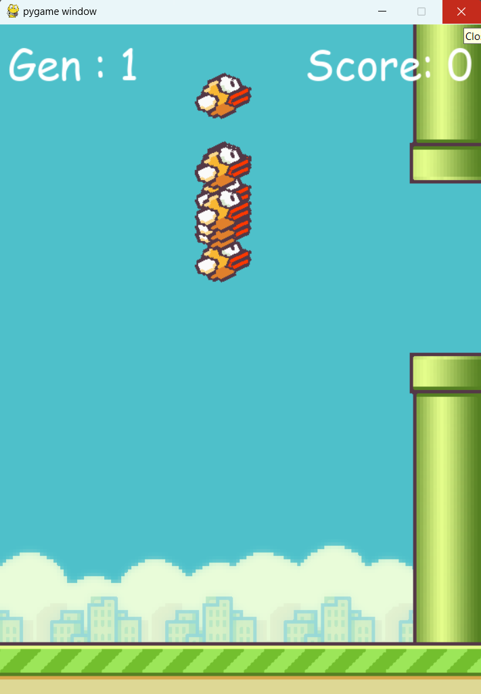
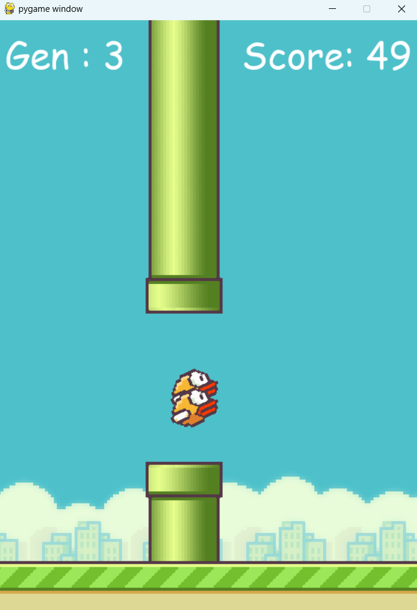

# Flappy Bird AI

This project implements a **Flappy Bird** game controlled by an AI using **NEAT** (NeuroEvolution of Augmenting Topologies). The AI evolves over generations to learn how to control the bird and avoid pipes based on its neural network. The game and AI are built using **Python**, **Pygame**, and **NEAT-Python**.

## Features

- **NEAT-Python** is used to evolve a neural network that controls the bird's actions.
- The game is built using **Pygame**, providing real-time graphical rendering and animation.
- The AI learns to play the game by interacting with the environment (bird and pipes).
- Visual feedback is provided through the score, generation count, and bird animation.
- Press **Esc** to stop the simulation, or it will automatically stop after achieving a score of 50.

## Example Images

### Gen-1 



### Later Gen after training




## Requirements

Before running the project, ensure you have the following dependencies installed:

- **Python 3.x**
- **Pygame**: For rendering the game.
- **NEAT-Python**: For training the AI using the NEAT algorithm.
- **keyboard**: For detecting key presses (e.g., Esc key).

You can install the dependencies using `pip`:

```bash
pip install pygame neat-python keyboard
```
## Installation

1. Clone the repository to your local machine:
```bash
git clone https://github.com/your-username/flappy-bird-ai.git
cd flappy-bird-ai
```
2. Install the required dependencies:

```bash
pip install pygame neat-python keyboard
```
3. Ensure the following files are present in the imgs/ directory:

- `bird1.png`, `bird2.png`, `bird3.png`: Bird animations
- `pipe.png`: Pipe image
- `base.png`: Base image
- `bg.png`: Background image

4. Ensure that the config-feedforward.txt file is present in the project directory. This file contains the configuration for the NEAT algorithm.


## Usage

Run the program using:

```bash
python main.py
```

## Controls
The game will automatically start training the AI.
Press Esc to manually stop training the current generation.

## Training Process
The AI uses the NEAT algorithm to evolve a population of neural networks. Each neural network receives the following inputs:

- The bird's current `y` position.
- The distance from the bird to the top of the next pipe.
- The distance from the bird to the bottom of the next pipe.

The neural network produces a single output that determines whether the bird should jump or not. The **fitness** of each genome is measured by the bird's **survival time** and **score**.


## Game Termination Conditions
The game will stop automatically if one of the following conditions is met:

1. **A Generation Achieves a Score of 50**: The simulation stops if any generation's score reaches 50. This condition helps the simulation determine when the AI has learned to play the game proficiently.


2. **A Bird Achieves a Fitness Score Above 100**: If any bird in the population achieves a fitness score above 100, the simulation will end. Fitness is awarded for survival time and the number of pipes passed, and this condition ensures that the AI has learned an effective strategy.

**Note**: You can also manually stop the training of current generation by pressing `esc` key. The game will then continue from the next generation, or if the **fitness value** of >=100 has been reached then the game will quit.

## How It Works
- **Bird Class**: Controls the bird's behavior, including its movement, jumping, and animation.
- **Pipe Class**: Handles the pipes, including their position, movement, and collision detection.
- **Base Class**: Manages the scrolling base that gives the illusion of continuous movement.
- **NEAT Algorithm**: The neural networks controlling the bird evolve over generations. The AI is trained using the NEAT-Python library to improve the bird's ability to navigate through pipes.

## NEAT Configuration
The `config-feedforward.txt` file contains parameters for the NEAT algorithm, such as:

- **Population size**: The number of genomes in each generation (can be tweaked for faster or slower evolution).
- **Mutation rates**: The probability that a gene in a genome will mutate
- **Neural network structure**: The architecture of the neural network, including the number of input and output nodes, and the number of hidden layers and neurons per layer.


You can adjust these parameters to experiment with different evolution settings to control the complexity and speed of learning.

Here is an example of configuration settings in the `config-feedforward.txt` file:

```bash 
[NEAT]
fitness_criterion     = max
fitness_threshold     = 50
pop_size              = 150
reset_on_extinction   = False

[DefaultGenome]
# Number of inputs and outputs
num_inputs           = 3
num_outputs          = 1
# Other settings related to the neural network architecture
```
Feel free to adjust the configuration file to experiment with different evolution settings.


## File Structure
- `main.py`: The main script that runs the Flappy Bird game and trains the AI.
- `config-feedforward.txt`: Configuration file for the NEAT algorithm, where you can adjust settings for the evolution process.
- `imgs/`: Folder containing game assets (bird, pipes, base, and background images).

## License

This project is open-source and can be freely used and modified. Feel free to contribute to the project, report bugs, or suggest new features!

## Credits
- **Flappy Bird Game**: Original game concept by Dong Nguyen. Game assets were adapted from the original Flappy Bird game.
- **NEAT Algorithm**: The AI implementation uses the NEAT (NeuroEvolution of Augmenting Topologies) algorithm, which is based on the work of Kenneth O. Stanley and the NEAT-Python library.
- **Pygame**: A set of Python modules used to create the game window, handle graphics, and control animations.

## References
[Pygame Documentation](https://neat-python.readthedocs.io/)

[NEAT-Python Documentation](https://neat-python.readthedocs.io/)

***
Enjoy training your own Flappy Bird AI and watching it improve over generations! 🐦🚀


